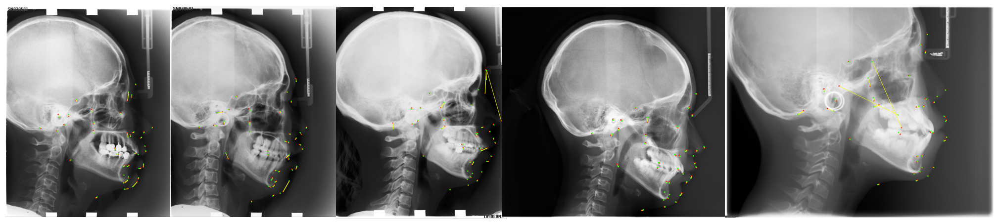

# CL-Detection 2023挑战赛基线模型

这个仓库提供了一个基于热图预测的思路的解决方法；同时，该仓库也提供了docker镜象的封装的教程，可以保证大家能够把自己算法模型上传到排行榜进行验证~

**提醒**：此仓库仅仅基于Pytorch框架进行构建，并无其他额外的框架依赖（比如：MMdetection），并且包含详细的中文代码注释，可以放心食用🍚🍚🍚


## 解决方案的思路

该仓库提供的基线解决方案是参考了2016年发表在MICCAI会议的论文[Regressing Heatmaps for Multiple Landmark Localization Using CNNs](https://link.springer.com/chapter/10.1007/978-3-319-46723-8_27).
具体来说，设计路径的流程如下图所示：


该研究的核心思想是通过将关键点坐标预测任务视为对应的热图回归任务，对每一个关键点都构建了一个高斯热图进行训练。
在这个仓库的实现上，我们简单地采用`UNet`模型作为热图回归的骨干网络，输入`512×512`大小的图像，输出38个通道的热图，最终以热图的最大值坐标作为关键点的坐标，得到38个关键点的预测。


## 复现实验结果

您可以按照下面的教程一步一步地练习，也可以下载训练过的权重文件然后运行 `step3_test_and_visualize.py` 来复现我们的结果。(注意，我们只提供训练到并未精心调优的权重，还有很多的优化空间).
还请别忘记了把下载好的权重拷贝一份到`step5_docker_and_upload`文件中，给模型预测进行调用。

权重文件下载：[[Google Drive](https://drive.google.com/file/d/1Qvnym4oGSG903ti0z2HE6Dm1udNO692G/view?usp=sharing)]
[[Baidu Drive](https://pan.baidu.com/s/1crjAXmQnz3pEEZpTzfTELA?pwd=94hU)]


## 如何在CL-Detection 2023数据集上运行此代码呢？

这一段代码可以很容易地在关键点检测任务上执行。这里，我们将整个过程分为五个步骤，以方便您可以轻松基于CL-Detection 2023数据集复现出结果或在您个人自定义数据集上执行整个过程。
 - step0, 准备环境
 - step1, 运行脚本 `step1_preprocessing.py` 来执行数据的预处理
 - step2, 运行脚本 `step2_train_and_valid.py` 训练和验证深度学习模型
 - step3, 运行脚本 `step3_test_and_visualize.py` 在未经处理的原始图像上测试模型
 - step4, 案例测试 `step4_predict_expected_output.py` 预测`stack1.mha`数据得到`expected_output.json`预测结果
 - step5, 打包上传 `step5_docker_and_upload` 将模型进行封装并上传Grand-Challenge平台 

**您应该提前下载好CL-Detection 2023 数据集格式，可参考挑战赛官网的[详细指导](https://cl-detection2023.grand-challenge.org/)：
您仅需要发送[注册表文件](https://drive.google.com/file/d/1wW9W6rkwJmZz9F3rWCNxK0iECbRSb55q/view?usp=sharing)到对应的邮件，拿到数据的可访问链接。放心，我们会快速审核通过的。或者加入官方的QQ交流答疑群：808896849，群主一直在很耐心地帮大家解决问题。**


### Step0：环境准备

我们已经在以下环境中测试了代码：
 - `Ubuntu` == 18.04
 - `cuda` == 11.8
 - `torch` =＝1.12.0
 - `torchvision` == 0.13.0

放心吧，仓库代码并没有特别的库依赖，只要在您的电脑上，可以导入`torch` 和`torchvision`，然后将相关的依赖安装上，相信环境问题不会存在。
如果有，也还请 [Issues](https://github.com/szuboy/CL-Detection2023/issues) 中提出来，我一定耐心地回复您的疑问直到解决问题。


### Step1：数据预处理

在步骤1中，您应该在`python`中运行脚本`step1_preprocessing.py`来执行处理。
对于CL-Detection 2023挑战赛的数据集，组织方考虑到存储的支出和分发的遍历，所有图像都进行0填充到统一的大小尺度(2400, 2880, 3)。
因此，都有一些不相关的区域需要删除，这个预处理脚本的主要功能就是处理这个问题。

代码运行后，您会得到一个文件夹和三个CSV文件：

- **一个文件夹**：这个文件夹存储的是解压后的`train_stack.mha`文件，包含了400张经过预处理操作，预处理操作是删除0填充无意义区域，然后进行了每一张图像的单独保存，图像保存格式默认是`BMP`格式；
- **三个CSV文件**：脚本默认生成对应的`train.csv`、`valid.csv`和`test.csv`三个文件，分别划分了300张、50张和50张图像，以便进行模型的训练、测试和验证；
生成的CSV文件均按照以下格式进行整理：`{图片文件路径},{像素的真实物理距离},{关键点X坐标}{关键点Y坐标}`：

|             file             | scale | p1x  | p1y  | p2x  | p2y  |   ...    |  ...  | p38y  |
|:----------------------------:|:-----:|:----:|:----:|:----:|:----:|:--------:|:-----:|:-----:|
| .../processed/images/104.bmp |  0.1  | 798  | 1106 | 1449 | 1030 |   ...    |  ...  | 1765  |
| .../processed/images/99.bmp  |  0.1  | 896  | 1062 | 1483 | 1681 |   ...    |  ...  | 1828  |
| .../processed/images/278.bmp | 0.125 | 1208 | 901  | 1681 | 785  |   ...    |  ...  | 1413  |
|              ┋               |   ┋   |  ┋   |  ┋   |  ┋   |  ┋   |    ┋     |   ┋   |   ┋   |


此仓库采取**训练-验证-测试**的模式，模型在训练集上进行训练，在验证集上进行模型训练和超参数的选择，然后在测试集上测试得到最终的模型性能表现。

**注意：** 上面的提高的图像预处理操作和数据集划分不是唯一的，你完全可以按照你的想法来进行数据处理和数据划分，亦或者是拓展为交叉验证的模式进行模型的训练验证。


### Step2：训练和验证
在步骤2中，
您可以执行脚本`step2_train_and_valid.py`来训练不同关键点的预测模型。
其中 `train.csv` 用于模型训练，在 `valid.csv`进行验证，基于`早停机制`和`最大迭代次数train_max_epoch`停止训练。
停止的条件是：模型在验证集上的`loss值`连续不下降`epoch_patience`数量，或者达到最大迭代次数`train_max_epoch`。

具体来说，你可以用以下两种方案进行不同关键点坐标预测模型的训练：

1. 在脚本 `step2_train_and_valid.py`中修改（设置）以下参数然后运行脚本，然后点击`RUN`即可。
```python
""" just set your param as the default value """
# data parameters
parser.add_argument('--train_csv_path', type=str, default='/data/zhangHY/CL-Detection2023/train.csv')
parser.add_argument('--valid_csv_path', type=str, default='/data/zhangHY/CL-Detection2023/valid.csv')

# model training hyperparameters
parser.add_argument('--cuda_id', type=int, default=0)
parser.add_argument('--batch_size', type=int, default=4)
parser.add_argument('--batch_size_valid', type=int, default=2)

# result & save
parser.add_argument('--save_model_dir', type=str, default='/data/zhangHY/CL-Detection2023/checkpoints')
```

2. 在终端上使用以下命令传输参数并运行脚本。
```
python step2_train_and_valid.py \
--train_csv_path='/data/zhangHY/CL-Detection2023/train.csv' \
--valid_csv_file='/data/zhangHY/CL-Detection2023/valid.csv' \
--batch_size=4 \
--cuda_id=0 \
--save_model_dir='/data/zhangHY/CL-Detection2023/checkpoints' \
```

执行完该脚本后，至此完成模型的所有训练后，您将得到一个关键点的热图预测的深度学习模型，能够同时预测38个头影关键点。

### Step3: 测试（或推理或预测）和可视化预测结果

在步骤3中，你应该运行脚本 `step3_test_and_visualize.py` 来对训练好的模型进行独立的测试，看看性能表现如何。
脚本将评估全部图片的38个关键点的性能，这也是挑战赛的统计方式。为了执行该脚本，您同样有两种方法进行操作：

1. 在脚本 `step3_test_and_visualize.py`中修改（设置）以下参数然后运行脚本，再点击`RUN`即可:
```python
""" just set your param as the default value """
# data parameters | 测试数据文件
parser.add_argument('--test_csv_path', type=str, default='/data/zhangHY/CL-Detection2023/test.csv')

# model load dir path | 存放模型的文件夹路径
parser.add_argument('--load_weight_path', type=str, default='/data/zhangHY/CL-Detection2023/checkpoints/best_model.pt')

# model test parameters
parser.add_argument('--cuda_id', type=int, default=0)

# result & save
parser.add_argument('--save_image', type=bool, default=True)
parser.add_argument('--save_image_dir', type=str, default='/data/zhangHY/CL-Detection2023/visualize')
```

2. 在终端上使用以下命令传输参数并运行脚本。
```
python step3_test_and_visualize.py \
--test_csv_path='/data/zhangHY/CL-Detection2023/test.csv' \
--load_weight_path='/data/zhangHY/CL-Detection2023/checkpoints/best_model.pt' \
--cuda_id=0 \
--save_image=True \
--save_model_dir='/data/zhangHY/CL-Detection2023/visualize' \
```

稍等一会，运行完脚本后，可以观察到模型在独立测试集上的`Mean Radial Error (MRE)`和`2mm Success Detection Rate(SDR)`这两个指标的表现，
大概为`MRE=3.323 mm`和`SDR=65.421%`。脚本并未固定随机种子，结果有一定小范围内的波动，可能会导致与作者提供的实验结果有一点点偏差，这是正常的。

下图是一些在`test.csv`文件中的测试图片的可视化，其中`红点`表示金标准，即医生的标记点，`绿点`表示模型的预测结果，`黄线`表示模型预测结果和医生标注之间的距离：




### Step4: 预测得到`expected_output.json`预测结果

为了进行`Docker`打包测试，我们提供了一个`stack1.mha`的测试文件，需要您基于自己开发设计的模型预测此数据，得到模型在本地的输出结果`expected_output.json`，
这为`Docker`中模型预测结果提供一个基准，保证模型无论在本地还是`Docker`环境结果都是一直的，保证封装是完全正确的。同样地，您有两种方法进行操作：

1. 在脚本 `step4_predict_expected_output.py`中修改（设置）以下参数然后运行脚本:
```python
""" just set your param as the default value """
# data parameters | 测试数据文件
parser.add_argument('--load_mha_path', type=str, default='/home/medai06/zhangHY/CL-Detection2023/step5_docker_and_upload/test/stack1.mha')
parser.add_argument('--save_json_path', type=str, default='/home/medai06/zhangHY/CL-Detection2023/step5_docker_and_upload/test/expected_output.json')

# model load dir path
parser.add_argument('--load_weight_path', type=str, default='/data/zhangHY/CL-Detection2023/checkpoints/best_model.pt')

# model test parameters
parser.add_argument('--cuda_id', type=int, default=0)
```

2. 在终端上使用以下命令传输参数并运行脚本。
```
python step4_predict_expected_output.py \
--load_mha_path='/home/medai06/zhangHY/CL-Detection2023/step5_docker_and_upload/test/stack1.mha' \
--save_json_path='/home/medai06/zhangHY/CL-Detection2023/step5_docker_and_upload/test/expected_output.json' \
--load_weight_path='/data/zhangHY/CL-Detection2023/checkpoints/best_model.pt'
--cuda_id=0 \
```

**注意**：由于`stack1.mha`只有两张测试图片，这个脚本将很快运行完，得到期待的输出文件`expected_output.json`。
不同模型算法的`expected_output.json`是不同的，想要测试自己的模型算法，必须重新执行一遍得到属于您的模型的期待的输出。


### Step5：封装为docker上传到grand-challenge平台进行测试

首先，需要保证自己的计算平台安装了`Docker`和`NVIDIA Container Toolkit`，这是整个算法封装的重要前提。
前者是保证可以进行封装，后者是保证`Docker`中可以调用`GPU`，一定一定确保自己的系统已经安装配置好！

其次，注意修改`requirements.txt`文件中的代码工程的相关依赖，保证预测过程中的相关依赖库都在里面，才能会正确的执行预测代码，得到预测结果。

然后，将自己的算法过程推理测试过程编程在`process.py`文件中的`predict()`函数中，并根据自己的`predict()`返回值更改`save()`函数。
值得注意的是，`predict()`函数的返回值并无强制要求，按照您的编程习惯来就好。再然后，通过执行`build.sh`脚本进行错误排除；如果一切顺利，你可能会看到以下内容：
```
[+] Building 298.7s (5/16)                                                                                       
 => [internal] load build definition from Dockerfile                                                        0.0s 
 => => transferring dockerfile: 4.07kB                                                                      0.0s 
 => [internal] load .dockerignore                                                                           0.0s
 => => transferring context: 61B                                                                            0.0s
 => [internal] load metadata for docker.io/pytorch/pytorch:1.9.0-cuda11.1-cudnn8-devel                      3.2s
 => CANCELED [ 1/12] FROM docker.io/pytorch/pytorch:1.9.0-cuda11.1-cudnn8-devel@sha256:ed167cae955fa654c  295.5s
 => => resolve docker.io/pytorch/pytorch:1.9.0-cuda11.1-cudnn8-devel@sha256:ed167cae955fa654cefc3663fc0c7b  0.0s
...
...
 => => naming to docker.io/library/cldetection_alg_2023                                                     0.0s
```

最后，执行`test.sh`脚本核实`Docker`输出结果和本地预测的结果是否一致。如果一致，则继续执行`export.sh`脚本导出可以上传到挑战赛平台的的`CLdetection_Alg_2023.tar.gz`文件。
如若不一致，还请认真排查错误，或者积极向挑战赛组织方积极反馈，亦或者毫不吝啬地在这里的Issue中提出来，我们会协助您一些解决问题。

## 可以给到参赛者什么建议嘛？

此仓库仅仅只是提供一个基线模型以及一个完整的训练+测试+封装的流程给到各位参赛者，模型性能的表现并没有很高，
组织方可能觉得还可以从以下方向进行优化，仅供参考：

- 更加针对性设计的预处理和数据扩增策略，目前仅仅采用的是简单的图像缩放，直接缩放到`(512, 512)`大小，和左右翻转的扩增策略；
- 替换更强大的骨干网络，比如：`HRNet`系列，`Hourglass`模型，以及自注意力机制的`Transformer`模型；
- 增加强大的注意力模块，现有的研究也是经常这么做的，这是一个能够提高模型泛化性和性能的不二选择；
- 该基线代码采用的是`L1`损失函数，选择一个好的损失函数，同样可以让深度学习模型学习更容易，更快速地收敛，达到更高的性能；

最后的最后，如果您在参与`CL-Detection 2023`挑战赛过程中遇到了什么难题，或者在运行此仓库代码遇到了什么错误，亦或者对该基线模型有什么更好的建议，
也还请不要吝啬地在[Issues](https://github.com/szuboy/CL-Detection2023/issues)中提出来哈，我一定积极地解答！