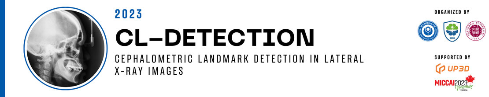
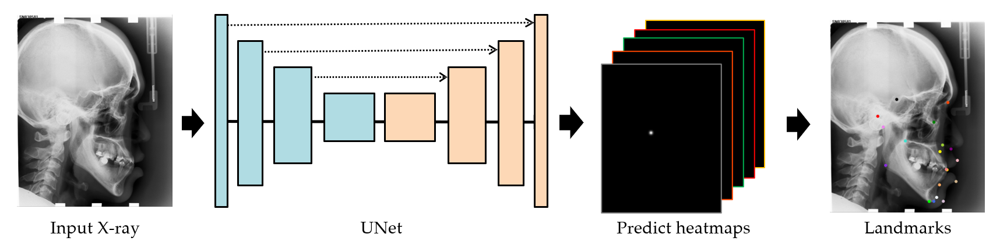

# CL-Detection 2023 Challenge Baseline Model

This repository provides a solution based on heatmap prediction for the CL-Detection 2023 Challenge.
Additionally, the repository includes a tutorial on packaging the solution as a Docker image,
ensuring that participants can upload their algorithm models for validation on the leaderboard.

**NOTE**：The solution is built solely on the PyTorch framework without any additional framework dependencies (e.g., MMdetection).
It contains detailed code comments for easy understanding and usage 🍚🍚🍚. 

[[Challenge Leaderboard 🏆](https://cl-detection2023.grand-challenge.org/evaluation/challenge/leaderboard/)]
[[中文版 README 👀](README-CN.md)]


## Pipline of This Solution

The baseline solution provided in this repository is based on a paper published in the 2016 MICCAI conference:
[Regressing Heatmaps for Multiple Landmark Localization Using CNNs](https://link.springer.com/chapter/10.1007/978-3-319-46723-8_27).
The overall process of the designed approach is illustrated in the following diagram:



In the implementation provided in this repository, a `UNet` model is used as the backbone network for heatmap regression.
The model takes input images of size 512×512 and outputs heatmaps with 38 channels.
The predicted coordinates of the landmarks are obtained by taking the coordinates of the maximum value in each heatmap.


## Reproducing the Experiment Results

Here is a step-by-step tutorial for you to follow.
Alternatively, you can download the pre-trained weight files and run `step3_test_and_visualize.py` to reproduce our results.
Please remember to copy the downloaded weights to the `step5_docker_and_upload` folder for model inference in Docker.

Weight files download link: 
[[Google Drive](https://drive.google.com/file/d/1Qvnym4oGSG903ti0z2HE6Dm1udNO692G/view?usp=sharing)]
[[Baidu Drive](https://pan.baidu.com/s/1crjAXmQnz3pEEZpTzfTELA?pwd=94hU)]


## How to run this code on the CL-Detection 2023 dataset or your own custom dataset?
This code can easily be executed for the landmark detection task.
Here, we have divided the entire process into five steps to facilitate the reproduction of results based on the CL-Detection 2023 dataset or to execute the entire process on your custom dataset.

- Step0: Environment Setup.
- Step1: Run the script `step1_preprocessing.py` to perform the preprocessing
- Step2: Run the script `step2_train_and_valid.py` to train and validate the deep learning model.
- Step3: Run the script `step3_test_and_visualize.py` to test the model on test images.
- Step4: Run the script `step4_predict_expected_output.py` to predict the `expected_output.json` results.
- Step5: Run the script `step5_docker_and_upload` to package the deep learning model.

**You should download the CL-Detection 2023 dataset in advance,
following the detailed instructions provided on the challenge's [official website](https://cl-detection2023.grand-challenge.org/).**

### Step0: Environment Setup

We have tested our code in following environment：

 - `Ubuntu` == 18.04
 - `cuda` == 11.8
 - `torch` =＝1.12.0
 - `torchvision` == 0.13.0

The repository code does not have any specific library dependencies.
As long as you have `torch` and `torchvision` installed on your computer,
you should be able to import them and install other dependencies.
If you encounter any problems, please feel free to raise them in the [Issues](https://github.com/szuboy/CL-Detection2023/issues).
I will patiently respond and work towards resolving any issues you encounter.


### Step1: Data Preprocessing

In Step 1, you should run the script `step1_preprocessing.py` in `Python` to perform the processing.
For the CL-Detection 2023 Challenge dataset,
the organizers have considered the costs of storage and distribution, and all images have been zero-padded to a uniform size of (2400, 2880, 3).
As a result, there are some irrelevant regions that need to be removed,
and the main purpose of this preprocessing script is to address this issue.

After running the code, you will obtain a folder and three CSV files:

- **A folder**: This folder contains the extracted train_stack.mha file. It includes 400 preprocessed images where the zero-padded irrelevant regions have been removed. Each image is saved separately, and the default image format is BMP.

- **Three CSV files**: The script generates train.csv, valid.csv, and test.csv files by default. These files divide the dataset into 300, 50, and 50 images, respectively, for training, testing, and validation purposes.

The generated CSV files are organized in the following format: `{image file path},{true physical distance of the pixel},{landmark X coordinate},{landmark Y coordinate}`.

|             file             | scale | p1x  | p1y  | p2x  | p2y  |   ...    |  ...  | p38y  |
|:----------------------------:|:-----:|:----:|:----:|:----:|:----:|:--------:|:-----:|:-----:|
| .../processed/images/104.bmp |  0.1  | 798  | 1106 | 1449 | 1030 |   ...    |  ...  | 1765  |
| .../processed/images/99.bmp  |  0.1  | 896  | 1062 | 1483 | 1681 |   ...    |  ...  | 1828  |
| .../processed/images/278.bmp | 0.125 | 1208 | 901  | 1681 | 785  |   ...    |  ...  | 1413  |
|              ┋               |   ┋   |  ┋   |  ┋   |  ┋   |  ┋   |    ┋     |   ┋   |   ┋   |

This repository follows a **train-validate-test** approach,
where the model is trained on the training set, further trained and hyperparameters are selected on the validation set,
and then tested on the test set to obtain the final model's performance.

**NOTE**: The image preprocessing operations and dataset splitting mentioned above are not the only options.
You are free to perform data processing and dataset splitting according to your preferences,
or even expand it to a cross-validation mode for model training and validation.


### Step2: Training and Validation

In Step 2, you can execute the script `step2_train_and_valid.py` to train models for predicting different landmarks.

The `train.csv` file is used for model training, and the `valid.csv` file is used for validation.
The training process utilizes an `early stopping mechanism`.
The training stops when either the model's loss on the validation set does not decrease for a consecutive number of epochs (`epoch_patience`),
or the maximum number of iterations (`train_max_epoch`) is reached.

Specifically, you can train models for predicting different landmarks using the following two approaches:

1. modify (set) following parameters in the script `step2_train_and_valid.py` and run the script.
```python
""" just set your param as the default value """
# data parameters
parser.add_argument('--train_csv_path', type=str, default='/data/zhangHY/CL-Detection2023/train.csv')
parser.add_argument('--valid_csv_path', type=str, default='/data/zhangHY/CL-Detection2023/valid.csv')

# model training hyperparameters
parser.add_argument('--cuda_id', type=int, default=0)
parser.add_argument('--batch_size', type=int, default=4)
parser.add_argument('--batch_size_valid', type=int, default=2)

# result & save
parser.add_argument('--save_model_dir', type=str, default='/data/zhangHY/CL-Detection2023/checkpoints')
```

2. use the following command at the terminal to transmit parameters and run the script.
```
python step2_train_and_valid.py \
--train_csv_path='/data/zhangHY/CL-Detection2023/train.csv' \
--valid_csv_file='/data/zhangHY/CL-Detection2023/valid.csv' \
--batch_size=4 \
--cuda_id=0 \
--save_model_dir='/data/zhangHY/CL-Detection2023/checkpoints' \
```

After executing this script and completing the training of the model,
you will obtain a deep learning model capable of predicting heatmaps for 38 landmarks locations simultaneously.


### Step3: Testing and Visualization

In Step 3, you should run the script `step3_test_and_visualize.py` to independently test the trained models and evaluate their performance.
The script will assess the performance of all 38 landmarks on the entire set of images,  which is the statistical approach used in the challenge.
To execute this script, you also have two options for operation:

1. In the script `step3_test_and_visualize.py`, modify the following parameters, then run the script and click on `RUN`:
```python
""" just set your param as the default value """
# data parameters | 测试数据文件
parser.add_argument('--test_csv_path', type=str, default='/data/zhangHY/CL-Detection2023/test.csv')

# model load dir path | 存放模型的文件夹路径
parser.add_argument('--load_weight_path', type=str, default='/data/zhangHY/CL-Detection2023/checkpoints/best_model.pt')

# model test parameters
parser.add_argument('--cuda_id', type=int, default=0)

# result & save
parser.add_argument('--save_image', type=bool, default=True)
parser.add_argument('--save_image_dir', type=str, default='/data/zhangHY/CL-Detection2023/visualize')
```

2. To run the script with the desired parameters in the terminal, you can use the following command:

```
python step3_test_and_visualize.py \
--test_csv_path='/data/zhangHY/CL-Detection2023/test.csv' \
--load_weight_path='/data/zhangHY/CL-Detection2023/checkpoints/best_model.pt' \
--cuda_id=0 \
--save_image=True \
--save_model_dir='/data/zhangHY/CL-Detection2023/visualize' \
```

After running the script, you can observe the performance of the model on the independent test set in terms of the `Mean Radial Error (MRE)` and `2mm Success Detection Rate (SDR)` metrics.
The approximate values are `MRE = 3.323 mm` and `2mm SDR = 65.421%`.
Since the script does not fix the random seed,
the results may have slight fluctuations within a small range,
which could cause slight deviations from the experimental results provided by the authors.

The following image shows the visualization of some test images from the `test.csv` file.
The `red dots` represent the ground truth, i.e., the annotated landmarks by the doctors,
while the `green dots` represent the model's predicted results.
The `yellow lines` indicate the distances between the model's predictions and the doctor's annotations:


### Step4: Example Testing

To test the model's predictions on the provided `stack1.mha` test file and obtain the model's output results `expected_output.json` locally,
you have two options for operation:

1. Please modify the following parameters in the script `step4_predict_expected_output.py` and then run the script:
```python
""" just set your param as the default value """
# data parameters | 测试数据文件
parser.add_argument('--load_mha_path', type=str, default='/home/medai06/zhangHY/CL-Detection2023/step5_docker_and_upload/test/stack1.mha')
parser.add_argument('--save_json_path', type=str, default='/home/medai06/zhangHY/CL-Detection2023/step5_docker_and_upload/test/expected_output.json')

# model load dir path
parser.add_argument('--load_weight_path', type=str, default='/data/zhangHY/CL-Detection2023/checkpoints/best_model.pt')

# model test parameters
parser.add_argument('--cuda_id', type=int, default=0)
```

2. To execute the script and pass the parameters through the command line interface:
```
python step4_predict_expected_output.py \
--load_mha_path='/home/medai06/zhangHY/CL-Detection2023/step5_docker_and_upload/test/stack1.mha' \
--save_json_path='/home/medai06/zhangHY/CL-Detection2023/step5_docker_and_upload/test/expected_output.json' \
--load_weight_path='/data/zhangHY/CL-Detection2023/checkpoints/best_model.pt'
--cuda_id=0 \
```

**NOTE**: Since `stack1.mha` only contains two test images, the script will run quickly, 
and you will obtain the expected output file `expected_output.json`.
The `expected_output.json` will be different for different model algorithms.
If you want to test your own model algorithm, you must rerun the script to obtain the expected output specific to your model.


### Step5: Packaging and Upload

First, make sure that `Docker` and `NVIDIA Container Toolkit` are installed on your computing platform as they are essential for the algorithm packaging.
The former ensures that you can perform the packaging, while the latter enables GPU utilization within Docker.
Be sure to confirm that your system has been properly installed and configured.

Next, make sure to modify the `requirements.txt` file to include the necessary dependencies for your code project.
This ensures that all the required libraries for the prediction process are included so that the prediction code can be executed correctly and produce the desired results.

Then,
implement your inference testing process in the `predict()` function within the `process.py` file,
and modify the `save()` function based on the return value of `predict()` function.
It's important to note that there are no strict requirements for the return value of the `predict()` function,
so you can structure it according to your programming preferences.

After that, execute the `build.sh` script to troubleshoot any errors. If everything goes smoothly, you may see the following output:
```
[+] Building 298.7s (5/16)                                                                                       
 => [internal] load build definition from Dockerfile                                                        0.0s 
 => => transferring dockerfile: 4.07kB                                                                      0.0s 
 => [internal] load .dockerignore                                                                           0.0s
 => => transferring context: 61B                                                                            0.0s
 => [internal] load metadata for docker.io/pytorch/pytorch:1.9.0-cuda11.1-cudnn8-devel                      3.2s
 => CANCELED [ 1/12] FROM docker.io/pytorch/pytorch:1.9.0-cuda11.1-cudnn8-devel@sha256:ed167cae955fa654c  295.5s
 => => resolve docker.io/pytorch/pytorch:1.9.0-cuda11.1-cudnn8-devel@sha256:ed167cae955fa654cefc3663fc0c7b  0.0s
...
...
 => => naming to docker.io/library/cldetection_alg_2023                                                     0.0s
```

Finally, execute the `test.sh` script to verify if the output results from Docker match the locally predicted results.
If they match, proceed to execute the `export.sh` script to export the `CLdetection_Alg_2023.tar.gz` file that can be uploaded to the challenge platform.


## Tips for Participants

This repository only provides a baseline model and a complete workflow for training, testing, and packaging for participants.
The performance of the model is not very high,
and the organizers may suggest the following directions for optimization as a reference:

- Design preprocessing and data augmentation strategies that are more targeted. This repository only involves simple image scaling to a size of `(512, 512)` and horizontal flipping for augmentation.
- Replace the backbone network with more powerful models such as the `HRNet`, `Hourglass` models, or `Transformer` models with self-attention mechanisms.
- Incorporate powerful attention modules. It is common in research to enhance model generalization and performance using attention mechanisms.
- Choosing a suitable loss function can make it easier for the deep learning model to learn and converge more quickly, leading to higher performance.

Finally,
if you encounter any challenges or difficulties while participating in the CL-Detection 2023 challenge,
encounter any errors while running the code in this repository,
or have any suggestions for improving the baseline model, please feel free to raise an issue.
I will be actively available to provide assistance and support.


